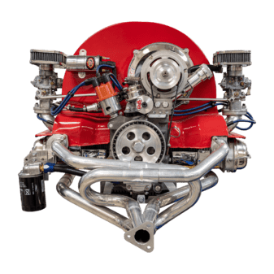

<div align="center">
  
  <h1 style="font-size: 28px; margin: 10px 0;">Ni Engine</h1>
  <p>Engine de jogos 2D feita com SFML e OpenGL</p>
</div>

<details>
<summary>Sumário (clique para exibir)</summary>
  
- [Descrição](#descrição)
- [Como usar](#como-usar)
  - [Template](#template)
  - [Biblioteca Estática](#biblioteca-estática)
- [Funcionalidades](#funcionalidades)
- [Tech Stack](#stack)
- [Ferramentas](#ferramentas)
- [Detalhes Técnicos](#detalhes-técnicos)
- [Licença](#licença)

</details>

## Descrição

A Ni Engine (Novas Ideias Engine) é escrita em C++ e feita utilizando SFML, uma biblioteca multimidia que facilita diversos processos como carregamento de texturas e renderização. A engine segue uma arquitetura baseada em componentes, que permite a criação de entidades totalmente personalizadas e modulares. Além disso, ela é totalmente customizável e está em desenvolvimento constante. No momento, meu principal objetivo com ela é ser capaz de criar um clone de terraria multiplayer.

## Como usar

#### Template

Você pode usar esse repositório como um template, a solução possui 2 projetos: NiEngine e Game. Toda a lógica relacionada ao seu jogo vai no projeto Game.

Para compilar é necessário baixar SFML e Box2D e descompactar os arquivos em:

```
C:/SFML
C:/Box2D
```

#### Biblioteca estática

Basta baixar a <a href="https://github.com/ericericmoura/ni-engine/releases/">última versão</a> e descompactar os arquivos.

```
├── include/NiEngine/ <- arquivos .h
└── lib/              <- arquivo  .lib
```

Depois, é só seguir o <a href="https://learn.microsoft.com/en-us/cpp/build/adding-references-in-visual-cpp-projects?view=msvc-170#consuming-static-libraries">guia da microsoft</a> em como adicionar bibliotecas estáticas a um projeto.

Você também precisará incluir <a href="https://www.sfml-dev.org/">SFML</a> e <a href="https://box2d.org/">Box2D</a> no seu projeto.

## Funcionalidades

As principais funcionalidades da engine incluem:

- Arquitetura expandivel baseada em componentes.
- Event Queue para eficiencia e performance ao tocar sons.
- Cache utilizando dicionários para sons, músicas e texturas para maior performance.
- Compatibilidade com o software <a href="https://www.mapeditor.org/">Tiled</a>, para criação de levels, tilemaps e objetos.
- Integrada com o Box2D.

## Stack

C++, [SFML](https://www.sfml-dev.org/), <a href="https://github.com/nlohmann/json">nlohmann/json</a>, <a href="https://box2d.org/">Box2D</a>

## Ferramentas

Visual Studio 2026, Git, [Tiled](https://www.mapeditor.org/)

## Detalhes técnicos

...

## Licença

[AGPL v3.0](https://choosealicense.com/licenses/agpl-3.0/)
