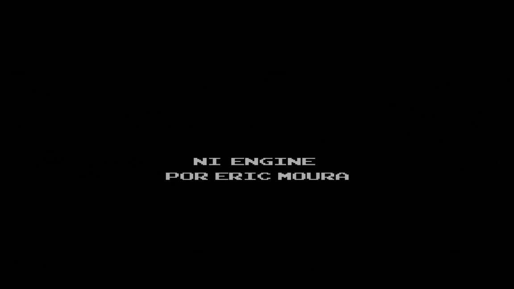
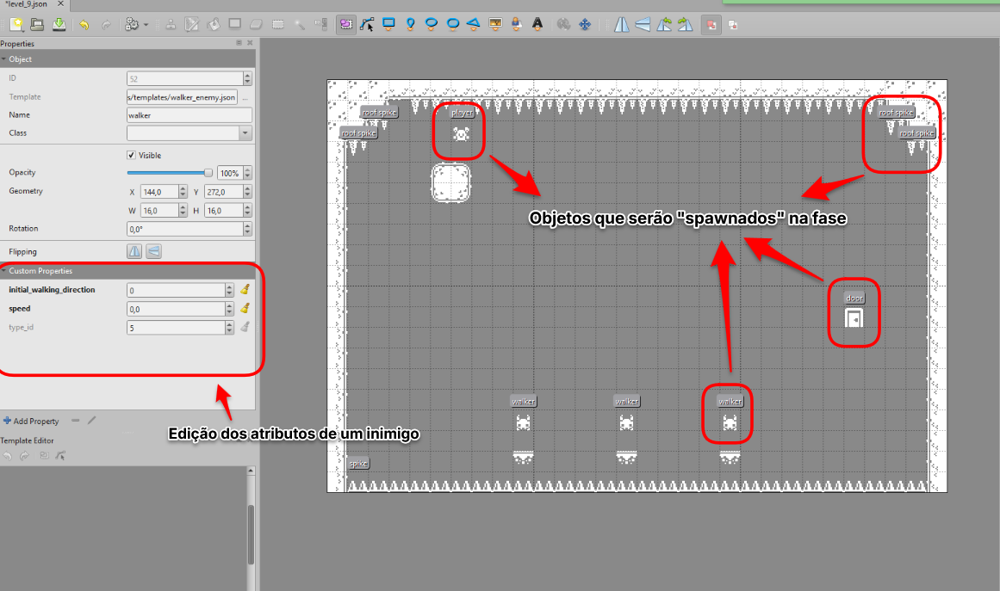

# Easy Game por Eric

- [Descrição](#descrição)
- [Funcionalidades](#funcionalidades)
- [Tech Stack](#stack)
- [Ferramentas](#ferramentas)
- [Detalhes Técnicos](#detalhes-técnicos)
  - [Exemplo da criação de uma fase](#exemplo-da-criação-de-uma-fase)
- [Screenshots](#screenshots)
- [Créditos](#créditos)
- [Licença](#licença)

## Descrição

Easy Game é um jogo inspirado por <a href="https://en.wikipedia.org/wiki/Syobon_Action">Cat Mario</a>, um jogo de plataforma 2D no estilo Super Mario com diversas armadilhas ocultas e obstaculos. O principal objetivo do jogo foi desenvolver a Ni Engine, além de aprimorar minhas habilidades com C++ e SFMl e expandir meu portfólio de projetos.

## Como jogar

É só baixar a <a href="https://github.com/ericericmoura/easy-game/releases">última versão do jogo</a>, descompactar e rodar o executável.

## Funcionalidades

As principais funcionalidades do jogo incluem:

- Interface com level atual e contador de mortes.
- Física e colisão de plataforma desenvolvidas do zero.
- Compatibilidade com o software <a href="https://www.mapeditor.org/">Tiled</a>, para criação de levels, tilemaps e objetos.
- Carregamento de levels em JSON.
- Arquitetura expandivel baseada em componentes
- IA para inimigos e certos obstáculos

## Stack

C++, <a href="https://github.com/ericericmoura/ni-engine">Ni Engine v0.1.0-beta</a>, [SFML](https://www.sfml-dev.org/), <a href="https://github.com/nlohmann/json">nlohmann/json</a>

## Ferramentas

Visual Studio 2026, Git, [Tiled](https://www.mapeditor.org/), Bfxr, Beepbox

## Detalhes técnicos

- Toda as colisões no jogo usam uma técnica de detecção de colisão chamada <a href="https://en.wikipedia.org/wiki/Minimum_bounding_box#Axis-aligned_minimum_bounding_box">AABB</a>.
- JSON foi usado para leitura de arquivos de fases e de configuração.
- Todos os atributos do personagem ( e inimigos) são totalmente customizáveis através da interface do Tiled usando objetos.

### Exemplo da criação de uma fase

## Screenshots

## Créditos

- Graficos: <a href="https://kenney.nl/assets/1-bit-platformer-pack">1-Bit Platformer Pack</a> pela equipe Kenney.
- Fontes: <a href="https://www.1001fonts.com/arcadeclassic-font.html">ARCADECLASSIC</a> por Jakob Fische.
- Sons: Criação própria
- Música: Criação própria

## Licença

[AGPL v3.0](https://choosealicense.com/licenses/agpl-3.0/)
